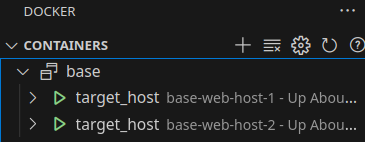

# ansible-docker-rh

Ansible development environment using docker and targeting RedHat 8 compatible containers.

The main objective develop and test ansible scripts in a easier way. 

The ansible scripts developed are available in subfolders of ```/02_ansible/base_master```.

## TL;DR

- key generation in host machine (bellow)

and

- run ```docker-compose up``` on ```01_hosts/```
- run ```docker-compose up``` on ```02_ansible/```
- run ```docker-compose up``` on ```03_traefik/```

The first command he first creates the ```target hosts``` containers,

The second command:
  - creates ```master ansible``` container,
  - installs and configure Apache on ```target hosts``` (ansible script),
  - deploy Javascript Chess App on ```target hosts``` (ansible script).

The third command creates reverse proxy/load balancer with names :
  - 'web.localhost' for Apache root and 
  - 'chess.localhost' for Chess App.


### Troubleshoot

If you get the following error, **close your active VPN connection**.

```
✘ Network ansible-net  Error                                                                                                             0.0s 
failed to create network ansible-net: Error response from daemon: could not find an available, non-overlapping IPv4 address pool among the defaults to assign to the network
```

### Key generation in host machine 

Ansible uses ssh for connection between ```master ansible``` and ```target hosts```. 

In order to allow that connection in a easy way, the pubKey authentication is enabled.  

A key pair is generated manually on host machine, and, later on, using volumes, the ```private key``` is shared with ```master ansible``` and the ```public key``` with the ```target hosts``` containers.

How to generate ```id_ed25519``` key pair run:

```
> ssh-keygen -t ed25519  -C 'my host computer key'
```

This will create two files in host machine ```home/your_user/.ssh/```:

```
    .ssh
    ├── id_ed25519
    ├── id_ed25519.pub
```

### Did it work out?

The software installed by Ansible are Apache web server and a javascript chess application on that web server.

You can assert that Apache is running by accessing [```"http://web.localhost"```](http://web.localhost). 

The chess application can be accessed on  [```"http://chess.localhost"```](http://chess.localhost). 

```"Chess Game Using JavaScript"``` application was obtained 24/08/2003 in: 

- https://www.sourcecodester.com/javascript/14325/chess-game-using-javascript.html (Apache License), 

no modifications were made. 

The zipped file [was scanned for virus at VirusTotal](https://www.virustotal.com/gui/file/d17c8358e644709f73098992f52f52a54ea4b671dcc3cba877b78a58c02f8c08), nothing malicious was detected.

## Details
---

This work is inspired mainly by two others:

- [1 - ansible-lab-docker](https://github.com/LMtx/ansible-lab-docker/tree/master)
- [2 - Running Ansible from inside Docker image for CI/CD pipeline](https://michalklempa.com/2020/05/ansible-in-docker/)

Classically the development of Ansible roles is done in VMs on the developer's own machine, optionally with the help of Vagrant to provide standardization.
  
There are a series of difficulties in developing using VMs such as problems with host machine virtualization, host machine overload, network configurations, mount points.
  
As an alternative to using VMs, we propose the use of containers as a basis for developing Ansible roles.
  
_"Containers consume much less resources making it possible to create larger test environments on your computer. The container is much faster to start/terminate than the standard virtual machine, which is important when you experiment and turn the entire environment on and off."_ [1]

The idea is to use containers with the aim of
- facilitate the development of Ansible roles for late use in a VM environments,
- share the work developed between DEVs and OPS in a reproducible way.

To achieve this objective, we needed to
- standardize the base image of target hosts, compatible with the VM OS,
- standardize the ansible base image, master node,
- compose environment images (docker-compose), according to the project at aim,
- run the roles in the image inventory, according to the project.

The idea is not to run services on containers, but to develop roles through experimentation in a flexible container based environment.

## ```base_host``` Dockerfile

The ```Dockerfile``` can be found in ```/01_hosts/base_host```.

The base image is UBI8, the [new de facto container base image for Red Hat Enterprise Linux 8](https://developers.redhat.com/articles/ubi-faq).

In order to receive ansible commands to be base image is added:
- python3
- openssh-server

The configuration of ```ssh-server``` in ```/etc/ssh/sshd_config``` is tweaked to allow ```PubKey Authentication```

```
  PasswordAuthentication no
  PermitRootLogin yes
  PubKeyAuthentication yes
  PubkeyAcceptedKeyTypes ssh-ed25519
  UsePAM yes
```

### ```target_host``` image and containers

From dir ```/01_hosts``` a sample of ```/docker-compose.yml```:

```
version: "1"
name: base
services:

  web-host: 
    build: ./base_host
    image: target_host
    privileged: true
    deploy:
      replicas: 2
    volumes:
      - ~/.ssh/id_ed25519.pub:/root/.ssh/authorized_keys
    command: chown root:root /root/.ssh/authorized_keys
    networks: 
      - ansible-net
```

Notice that web-host runs **privileged**, because running ssh-server on port 80 can only be done by a privileged user. 

When we run this with ```docker-compose up```, 
- the image ```target_host``` is build from ```Dockerfile``` in ```/base_host``` subfolder,
- the ```replicas: 2``` allows us to create two identical containers,
  - each container receive a name compose of
    - ```name``` of Dockerfile, which, in the case, is ```base```, 
    - ```name``` of service, ```web-host```,
    - ```replica number```, ```1, 2``` 
  - resulting in two containers:
    - ```base-web-host-1``` and
    - ```base-web-host-2```



## ```base_master``` Dockerfile

The image is alpine based, with added 

- ansible
- openssh-client
- git

The ```Dockerfile``` can be found in ```/02_ansible/base_master```.

Added to the configuration of ```ssh-client``` in ```/etc/ssh/ssh_config``` 

```
  StrictHostKeyChecking no
  UserKnownHostsFile=/dev/null
```

Meaning that ssh client will accept any ServerKey from hosts reached.

Finally the **working directory** is ```/ansible```:

```
WORKDIR /ansible
```

### ```ansible_base_master``` image and containers

Excerpt from docker-compose.yml:

```
  apache-install:
    build: ./base_master
    image: ansible_base_master:latest
    privileged: true
    volumes:
      - ~/.ssh:/root/.ssh
      - ./base_master/ansible-1-apache-install:/ansible
    networks: 
      - ansible-net       
    command: ["/bin/sh","-c","./ansible-1-apache-install.sh"]
```

 Notice that the volume ```./base_master/ansible-1-apache-install``` is mapped to the **working directory** ```ansible```, allowing it to access any resource on the volume.

### docker run alternatives

Running ```docker-compose-up``` on ```/02_ansible/base_master``` executes two services

- ```apache-install``` and
- ```apache-deploy```

As alternative the services are also available by ```docker-run``` in the same folder: 

- ```./docker-1-run-apache-install.sh``` and
- ```./docker-2-run-apache-deploy.sh```

Before running then, build the image using ```docker-0-build-image.sh```

#### Ansible scripts

The main objective is to develop and test ansible scripts, they are available in subfolders of ```/02_ansible/base_master```, in the case of Apache, subfolders:

- ```ansible-1-apache-install``` and
- ```ansible-2-apache-deploy```

Inside each folder there is a shell script with ansible commands, as in ```ansible-1-apache-install.sh```:

```
ansible-galaxy install -r requirements.yml 
ansible-playbook -i inventory base.yml
```

The ```inventory``` file  contains the groups of hosts

```
[web_hosts]
base-web-host-[1:2]
```

The ```base.yml``` file contain the Ansible tasks/roles, ex:

```
---
- hosts: web_hosts

  vars_files:
    - vars/main.yml

  tasks:
    - name: Create user "{{ user_name }}"
      import_role:
        name: create-users
      become: true

    - name: install apache
      include_role: 
        name: geerlingguy.apache
        apply: 
          become: true
```

Notice that we are including a community role from Ansible Galaxy called ```geerlingguy.apache``` (see ```requirements.yml``` file). This role does the job of installing Apache.


### docker-compose ```traefik```

You can access the web server through the IP attributed to the host, ex: 172.21.0.3, or access through a reverse proxy.

The load balancer traefik maps a two names to the web hosts, ```web.localhost``` and ```chess.localhost```:

```
## DYNAMIC CONFIGURATION

http:
  routers:
    route-to-local-ip:
      rule: "Host(`web.localhost`,`chess.localhost`)"
      service: route-to-web-host

  services:
    route-to-web-host:
      loadBalancer:
        servers:
          - url: "http://base-web-host-1:80"
          - url: "http://base-web-host-2:80"
```          

TODO: protect Apache Password: 
 - https://www.redhat.com/sysadmin/ansible-playbooks-secrets

TODO: issue TLS Certificate for Apache: 
 - https://docs.ansible.com/ansible/latest/collections/community/crypto/acme_certificate_module.html
 - https://letsencrypt.org/docs/certificates-for-localhost/
 - https://smallstep.com/blog/private-acme-server/