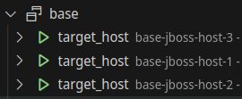

Branch 'jboss-install' contains installation of 

- Single Instance Postgres and 
- Cluster of Jboss (Domain Mode).

FINISHED DEVELOPMENT,  Jun/2024, will not merge this branch with main, they have distinct purposes.

## requirements

On host environments where internet navigation is subject to proxy intermediary, some inter-(docker-machine) communications can be wrongfully send to the proxy. To avoid route through proxy for docker 172.0.0.0/8 addresses, it is imperative to add 'noProxy' configuration as below:
  
```~/.docker/config.json```:

```
{
	"auths": {},
	"proxies": {
		"default": {
			"httpProxy": "http://172.17.0.1:3128",
			"httpsProxy": "http://172.17.0.1:3128",
			"noProxy": ".local,.localhost,.internal,localhost,0.0.0.0,127.0.0.1,127.0.0.11,172.0.0.0/8"
		}
	}
}
```

PS: this rule is was tested for RHEL docker based containers (target hosts) based on RHEL

# ansible-docker-rh

Ansible development environment using docker and targeting RedHat 8 compatible containers.

The main goal is to have a foundation to easily develop and test Ansible scripts.

The ansible scripts in development are available in subfolders of ```/02_ansible/base_master```.

## TL;DR

- run ```docker-compose up``` on ```01_hosts/```
- run ```docker-compose up``` on ```02_ansible/```
- run ```docker-compose up``` on ```03_traefik/```

The first command creates the ```target hosts``` containers,

The second command:
  - creates ```master ansible``` container,
  - installs and configure Postgres on ```one target host``` (ansible script),
  - installs and configure Jboss on ```target hosts``` (ansible script),  

The third command creates reverse proxy/load balancer for Jboss Admin Controller with names :
  - 'console.localhost:8000/console'

## Troubleshoot

If you get the following error:

```
✘ Network ansible-net  Error                                                                                                             0.0s 
failed to create network ansible-net: Error response from daemon: 
could not find an available, non-overlapping IPv4 address pool among the defaults to assign to the network
```

**close your active VPN connection**

## Key generation in host machine 

Ansible uses ssh for connection between ```master ansible``` and the ```target hosts```. 

In order to allow the connection in a easy way, the pubKey authentication is enabled.  

A ssh key pair is generated automatically by a keypair image/container in ```/01_hosts/base_keypair```.

The keypair is placed by a volume in ```/tmp/.ansible-tmp/master_ssh_key_pair/```

```
    .ssh/master_ssh_key_pair
    ├── id_ed25519
    ├── id_ed25519.pub
```

Later on, using volumes, the ```private key``` is shared with ```master ansible``` and the ```public key``` with the ```target hosts``` containers.

## Did it work out?

The software installed by Ansible are Postgres and Jboss in Domain Mode (master + slaves).

To test manually the environment access [```"http://console.localhost:8000/console"```](http://console.localhost:8000/console), input jboss/jboss00 for user/pwd, access menus
- Runtime
    - Server Groups
        - 'server_group_A'
            - 'A_config' (select one host)
                - Datasources
                    - Select 'db1DS'
                    - Click 'Test' button, the result should be 'Successfully tested connection for datasource db1DS'.

## Details
---

This work is inspired mainly by two others:

- [1 - ansible-lab-docker](https://github.com/LMtx/ansible-lab-docker/tree/master)
- [2 - Running Ansible from inside Docker image for CI/CD pipeline](https://michalklempa.com/2020/05/ansible-in-docker/)

Usually the development of Ansible roles is done in VMs on the developer's own machine, optionally with the help of Vagrant to provide standardization.
  
There are a series of difficulties in developing using VMs such as problems with host machine virtualization, host machine overload, faulty network configurations, mount points problems.
  
As an alternative to using VMs, we propose the use of containers as a basis for developing Ansible roles.
  
_"Containers consume much less resources making it possible to create larger test environments on your computer. The container is much faster to start/terminate than the standard virtual machine, which is important when you experiment and turn the entire environment on and off."_ [1]

The idea is to use containers with the aim of
- facilitate the development of Ansible roles for late use in a VM environments,
- share the work developed between DEVs and OPS in a reproducible way.

To achieve this objective, we needed to
- standardize the base image of target hosts, compatible with the VM OS,
- standardize the ansible base image, master node,
- compose environment images (docker-compose), according to the project at aim,
- run the roles in the image inventory, according to the project.

The idea is not to run services on containers, but to develop roles through experimentation in a flexible container based environment.

## ```base_host``` Dockerfile

The ```Dockerfile``` can be found in ```/01_hosts/base_host```.

The base image is UBI8, the [new de facto container base image for Red Hat Enterprise Linux 8](https://developers.redhat.com/articles/ubi-faq).

In order to receive ansible commands to be base image is added:
- python3
- openssh-server

The configuration of ```ssh-server``` in ```/etc/ssh/sshd_config``` is tweaked to allow ```PubKey Authentication```

```
  PasswordAuthentication no
  PermitRootLogin yes
  PubKeyAuthentication yes
  PubkeyAcceptedKeyTypes ssh-ed25519
  UsePAM yes
```

### ```target_host``` image and containers

From dir ```/01_hosts``` a sample of ```/docker-compose.yml```:

```
version: "3"
name: base
services:

  jboss-host:
    build: ./base_host
    image: target_host
    depends_on: 
      keypair:
        condition: service_completed_successfully
      postgres-module:
        condition: service_completed_successfully        
    privileged: true
    deploy:
      replicas: 3
    volumes:
      - /tmp/.ansible-tmp/master_ssh_key_pair/id_ed25519.pub:/root/.ssh/authorized_keys
    networks: 
      - ansible-net
```

Notice that web-host runs **privileged**, because running ssh-server on default port (22) can only be done by a privileged user. 

When we run this with ```docker-compose up```, 
- the image ```target_host``` is build from ```Dockerfile``` in ```/base_host``` subfolder,
- the ```replicas: 3``` allows us to create two identical containers,
  - each container receive a name compose of
    - ```name``` of Dockerfile, which, in the case, is ```base```, 
    - ```name``` of service, ```jboss-host```,
    - ```replica number```, ```1, 2``` 
  - resulting in two containers:
    - ```base-jboss-host-1```
    - ```base-jboss-host-2``` and
    - ```base-jboss-host-3``` and    



### Convenience services

To avoid downloading files every run, two services were created: ```get_files``` and ```base_http_serve```, files served on http://localhost:8088

```
  # serve files needed by ansible tasks
  http-serve-files:
    build: ./base_http_serve
    image: http_serve
    container_name: serve.local
    depends_on: 
      get-files:
        condition: service_completed_successfully
    volumes:
      - /tmp/ansible-tmp:/serve/
    ports:
      - 8088:8000
    networks: 
      - ansible-net
```

The download scripts are available under ```get_files/scripts/get_all-files.sh```, adjust the get ```repo``` address accordingly, can be a local address:

```
#jboss previous from local file
declare -A obj1=(
     [file]="jboss-eap-7.4.tar.gz"
     [repo]="~/Downloads/jboss"
     [is_repo_remote]=false
     [download_to_dir]="/tmp/ansible-tmp/jboss"
     [local_file_name]=''
)
```

- Another useful service available is the **Hashi Vault**, it helps to use 'secrets' in a safe way.

```
  #vault for protected key/values
  hashi_vault.local:
    build: ./vault
    image: hashi_vault
    container_name: vault.local
    ports:
      - 8200:8200
    cap_add:
      - IPC_LOCK
    volumes:
      - ./vault/config/:/work_dir/
    networks: 
      - ansible-net
    command: ./run.sh
```

The scripts under ```vault/config``` inserts all values needed by the Ansible tasks

```
vault secrets enable -path=MyCompany kv

vault kv put -mount=MyCompany MyContext/jboss/MyInstance @kv-jboss.json
```

Here are values of ```kv-jboss.json``` used for test purposes

```
{
    "os_user": "jboss",
    "os_user_pwd": "jboss123",
    "os_user_group": "jboss",    

    "mgmt_user": "jboss",
    "mgmt_user_pwd": "jboss00",
    "app_user": "user",
    "app_user_pwd": "user00"
}
```

Also for test purposes, the value of ```VAULT_TOKEN``` if fixed in images, 

```
ENV VAULT_TOKEN=vault_root_token
ENV VAULT_ADDR=http://0.0.0.0:8200
```

It is fixed in both images, ```base_vault``` and ```ansible_base_master```, so that an ansible task can retrieve the value directly:

```
#jboss OS user
jboss_os_user: "{{ lookup('hashi_vault', 'secret=MyCompany/MyContext/jboss/MyInstance:os_user') }}"
jboss_os_user_pwd: "{{ lookup('hashi_vault', 'secret=MyCompany/MyContext/jboss/MyInstance:os_user_pwd') }}"
jboss_os_user_group: "{{ lookup('hashi_vault', 'secret=MyCompany/MyContext/jboss/MyInstance:os_user_group') }}"
```

## ```base_master``` Dockerfile

The image is alpine based, with added 

- ansible
- openssh-client
- git

The ```Dockerfile``` can be found in ```/02_ansible/base_master```.

Added to the configuration of ```ssh-client``` in ```/etc/ssh/ssh_config``` 

```
  StrictHostKeyChecking no
  UserKnownHostsFile=/dev/null
```

Meaning that ssh client will accept any ServerKey from hosts reached.

Finally the **working directory** is ```/ansible```:

```
WORKDIR /workdir
```

### ```ansible_base_master``` image and containers

Excerpt from docker-compose.yml:

```
  pg-install:
    image: ansible_base_master:latest
    build: ./base_master
    privileged: true
    volumes:
      - /tmp/.ansible-tmp/master_ssh_key_pair/:/root/.ssh/
      - /tmp/.ansible-tmp/:/root/.ansible/
      - ./base_master/ansible-1-pg-install:/workdir/
    networks: 
      - ansible-net       
    command: ["/bin/sh","-c","./ansible-playbook.sh"]
```

 Notice that the volume ```./base_master/ansible-1-pg-install``` is mapped to the **working directory** ```workdir```, allowing it to access any resource on the volume.

### docker run alternatives

Running ```docker-compose up``` on ```/02_ansible/base_master``` executes three services

- ```pg-install```,
- ```jboss-install``` and
- ```jboss-config```

As alternative, the services are also available by ```docker-run``` scripts in the same folder: 

- ```./docker-1-run-pg-install.sh```,
- ```./docker-2-run-jboss-install.sh``` and
- ```./docker-3-run-jboss-config.sh```

Before running then, build the image with ```./docker-0-build-image.sh```

```docker-run``` scripts are 

Those scripts are more development oriented, you can run one each time and check the results, another advantage is that you don't ever need to run ```docker-compose down``` before a new run.

#### Ansible scripts

The main objective is to develop and test ansible scripts, they are available in subfolders of ```/02_ansible/base_master```, in subfolders:

- ```ansible-1-pg-install```,
- ```ansible-2-jboss-install``` and
- ```ansible-3-jboss-config```

Inside each folder there is a shell script with ansible commands, as in ```ansible-2-jboss-install/ansible-playbook.sh```:

```
ansible-galaxy install -vvv -r requirements.yml 
export ANSIBLE_STDOUT_CALLBACK=unixy
ansible-playbook -v -i inventory.yml base.yml
```

The ```inventory``` file  contains the groups of hosts

```
master:
  hosts:
    base-jboss-host-1:

slaves:
  hosts:
    base-jboss-host-[2:3]:
```

The ```base.yml``` file contain the Ansible tasks/roles, ex:

```
---
- hosts: web_hosts

  vars_files:
    - vars/main.yml

  tasks:
    - name: Create user "{{ jboss_os_user }}"
      import_role:
        name: create-users
      become: true

    - name: install Jboss
      import_role:
        name: install-app-extracted
      vars:
        dest_dir: "{{ dest_dir_JBOSS }}"
        extract_dir: "{{ tmp_extract_dir_JBOSS }}"
        app_archive: "{{ app_archive_JBOSS }}"
        dest_dir_owner: "{{ jboss_os_user }}"
        dest_dir_group: "{{ jboss_os_user }}"
      become: true  
      become_user: "{{ jboss_os_user }}"
```

The Jboss configuration is all done using ```jboss-cli.sh```, scripts are available under 

- ```ansible-3-jboss-config/scripts```
    * ```/cli-config-master``` and 
    * ```cli-config-slaves```.

### docker-compose ```traefik```

You can access the web server through the IP attributed to the host, ex: 172.25.25.7:8080, or access through a reverse proxy.

The load balancer traefik configuration maps name to master host, ```console.localhost:8000```

```
## DYNAMIC CONFIGURATION

http:
  routers:
    route-to-jboss-console:
      rule: "Host(`console.localhost`)"
      service: service-jboss-console

  services:
    service-jboss-console:
      loadBalancer:
        servers:
          - url: "http://base-jboss-host-1:9990"
```          

TODO: issue TLS Certificate for Jboss: 
 - https://docs.ansible.com/ansible/latest/collections/community/crypto/acme_certificate_module.html
 - https://letsencrypt.org/docs/certificates-for-localhost/
 - https://smallstep.com/blog/private-acme-server/